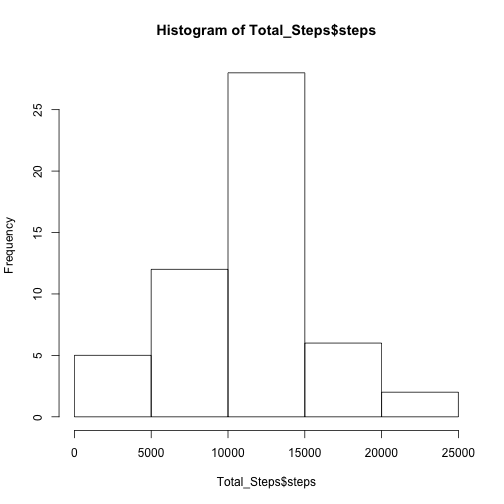
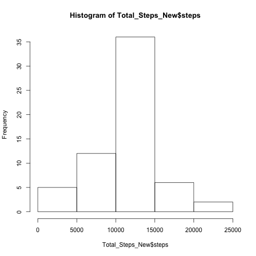
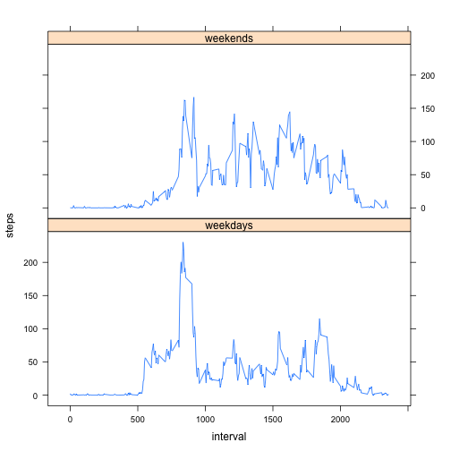

## Loading and preprocessing the data

```r
# Reset working directory
setwd("~/Desktop/Data Science - Specialization | Coursera/5. Reproducible Research/Peer Assignments/RepData_PeerAssessment1")
# Loading data
unzip("activity.zip")
Dataset <- read.csv("activity.csv")
```


## What is mean total number of steps taken per day?

```r
# Total steps per day
Total_Steps <- aggregate(steps ~ date, Dataset, sum, na.rm = TRUE)
# Histogram of total steps per day
hist(Total_Steps$steps)
```

 

```r
# Mean steps per day
mean(Total_Steps$steps)
```

```
## [1] 10766.19
```

```r
# Median steps per day
median(Total_Steps$steps)
```

```
## [1] 10765
```


## What is the average daily activity pattern?

```r
# Daily average steps to 5 min interval
Mean_Steps_Interval <- aggregate(steps ~ interval, Dataset, mean, na.rm = TRUE)
with(Mean_Steps_Interval, plot(steps ~ interval, type = "l"))
```

 

```r
# 5 min interval with max steps
Max_Row <- which.max(Mean_Steps_Interval$steps)
Mean_Steps_Interval$interval[Max_Row]
```

```
## [1] 835
```


## Imputing missing values

```r
# Number of NAs
bad <- is.na(Dataset$steps)
sum(bad == TRUE)
```

```
## [1] 2304
```

```r
# New data with NAs filled (5 min interval)
No_Of_Interval <- nrow(Mean_Steps_Interval)
No_Of_Day <- round(nrow(Dataset)/No_Of_Interval)
Dataset_Fill <- Dataset
for(i in 1:No_Of_Day){
    for(j in 1:No_Of_Interval){
        if(is.na(Dataset_Fill$steps[(i - 1)*No_Of_Interval + j])){
            Dataset_Fill$steps[(i - 1)*No_Of_Interval + j] = Mean_Steps_Interval$steps[j]}}}
# New histogram of total steps per day
Total_Steps_New <- aggregate(steps ~ date, Dataset_Fill, sum)
hist(Total_Steps_New$steps)
```

 

```r
# New mean steps per day
mean(Total_Steps_New$steps)
```

```
## [1] 10766.19
```

```r
# New median steps per day
median(Total_Steps_New$steps)
```

```
## [1] 10766.19
```

```r
# New mean steps per day decreased a little bit, because the new added mean 5-minutes interval, which are to replace the missing values, are values smaller than the mean steps. This indicates that smaller values are more difficult to be detected, so that they are more likely to form missing values. Imputing missing data makes the estimates more close to the real situation, in which smaller values are less likely to be detected.
```


## Are there differences in activity patterns between weekdays and weekends?

```r
# Create new column to data.frame
daytype <- function(date) {
    if (weekdays(as.Date(date)) %in% c("Saturday", "Sunday")) {
        "weekends"
    } else {
        "weekdays"}}
Dataset_New <- Dataset_Fill
Dataset_New$daytype <- sapply(Dataset_Fill$date, daytype)
# Make a new plot
Mean_Steps_Interval_New <- aggregate(steps ~ interval + daytype, Dataset_New, mean)
library(lattice)
xyplot(steps ~ interval | daytype, data = Mean_Steps_Interval_New, type = "l", layout = c(1, 2)) 
```

 


## Convert Rmd into HTML

```r
library(markdown)
library(knitr)
knit2html("PA1_template.Rmd")
```

```
## 
## 
## processing file: PA1_template.Rmd
```

```
## Error in parse_block(g[-1], g[1], params.src): duplicate label 'setoptions'
```
